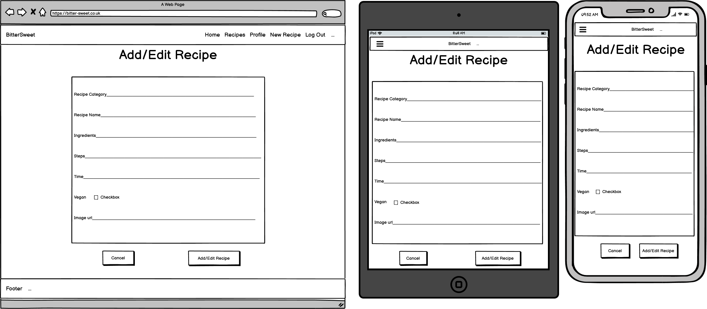

<h1 align="center"></h1>

[View the live website here.](https://bitter-sweet-milestone-3.herokuapp.com/)

# BitterSweet

This website is a chocolate themed recipe sharing site. Anybody can create an account and share their chocolate inspired recipes. 

Any user can view all recipes on the site, however only a registered user can add/edit/delete their own recipes. To compliment these chocolate recipes
BitterSweet©, which is a new chocolate company, would like to promote their products to be used to create these chocolate dishes. 

## The important things to consider were:

1. Working with MongoDB as the non-relational database to store the recipes and user information.
2. Using Flask as a framework.
3. The C.R.U.D functionality - the users must be able to Create, Read, Update and Delete their own recipes - but not anyone else's for security.
4. A search function to locate recipes by name or ingredients.
5. The date displayed must be user friendly and visually appealing.

## User stories

- #### Site user goals
    1. As a site user, I want to be able to register for the site and navigate it easily, then to be able to log in and out when I wish.
    2. As a site user, I want to be able to view the recipes already on the site, but also to add and display my own.
    3. As a site user, I want to be able to edit and/or delete my recipes when I want to.

- #### Site owner goals
    1. As a site owner, I want to promote the company BitterSweet© and to suggest the users try these new chocolate products in the recipes.
    2. As a site owner, I want the users to be able to create an acocunt and navigate the site easily, as well as create/edit/delete their recipes as much as they choose to.
    3. As a site owner, I want the users to be able to search through the chocolate recipes on the site for keywords or ingredients.

-   ### Design
    -   #### Colour Scheme
        -   The main colours used are shades of brown, purple and white, as these complement each other nicely and are suggestive of the classic colours of Cadbury's, however 
        as this is a site for the purpose of learning no copyright infringement is intended. 
    -   #### Typography
        -   The Satisfy font is used for the navbar and page titles, as it resembles the font used in the logo. Baloo Tammudu 2 is also used for the paragraphs with information, 
        as this makes them easier to read. Sans Serif is the fallback font in case for any reason the font isn't being imported into the site correctly. These fonts are attractive 
        and appropriate to the aesthetic of the site. The font colour throughout is dependent on the background and the tupe of content to make it stand-out and for ease of reading 
        against the background.
    -   #### Imagery
        -   I created the site logo using Adobe Photoshop and a stock photo located online that I edited to suit my purpose. 
        -   I created the vegan chocolate wrapper design and the other chocolate wrapper design on the index page using Adobe Photoshop and stock photos located online. 
        This site is for educational purposes only and no copyright infringement is intended - just an example of product placement for my created chocolate company.
        -   The imagery used for the recipes is dependent on the content uploaded by the user. I was unable to create a system where the user uploads their own photo 
        directly to the site, however, they can upload to a free hosting platform that I have linked to in my new recipe form, they just need to paste the image url to the 
        site and it will display with the recipe details.

## Wireframes page designs:

Home page:

Register Page:

Log In Page:

Profile Page:

All Recipes Page:

Add / Edit Recipes Page:

Categories Page - only for the Admin:

## Features

-   Responsive on all device sizes. For example:

## Technologies Used

### Languages Used

-   In this project I used [HTML5](https://en.wikipedia.org/wiki/HTML5), [CSS3](https://en.wikipedia.org/wiki/Cascading_Style_Sheets), [JQuery](https://jquery.com/), 
[JavaScript](https://en.wikipedia.org/wiki/JavaScript) and [Python](https://en.wikipedia.org/wiki/Python_(programming_language)). 

### Frameworks, Libraries & Programs Used

-   [Google Fonts:](https://fonts.google.com/) Google fonts were used to import the 'Satisfy' font into the style.css file which is used on all pages throughout the project.
-   [Font Awesome:](https://fontawesome.com/) Font Awesome was used on all pages throughout the website to add icons for aesthetic and UX purposes.
-   [GitHub:](https://github.com/) GitHub is used to store the projects code after being pushed from Git.
-   [Git:](https://git-scm.com/) Git was used for version control by utilizing the Gitpod terminal to commit to Git and Push to GitHub.
-   [Responsinator:](http://www.responsinator.com/) Responsinator was used to check the site was responsive across all devices.
-   [Balsamiq:](https://balsamiq.com/) Balsamiq was used to create the wireframes during the design process.
-   [Lighthouse](https://developers.google.com/web/tools/lighthouse)
-   Chrome, Microsoft Edge & Firefox internet browsers.
-   Adobe Photoshop.
-   I also made use of the [Materialise framework library](https://materializecss.com/getting-started.html).

## Testing

### Manual Testing documentation

[Please see the testing file](testing.md)

### Validators

The W3C Markup Validator and W3C CSS Validator Services were used to validate every page of the project to ensure there were no syntax errors in the project.

JSHint was used to check there were no errors in the JavaScript code, while there may be some warnings after running the JS though JSHint, they are mainly that a lot of 
the code is only available in ES6, but this was the code I was taught and there are no errors with the code, it works on all systems tested so I am keeping it with the ES6 version.

### Testing User Stories from User Experience (UX) Section

- #### Site user goals
    1. As a site user, I want to be able to register for the site and navigate it easily, then to be able to log in and out when I wish.
        -   

    2. As a site user, I want to be able to view the recipes already on the site, but also to add and display my own.
        -   

    3. As a site user, I want to be able to edit and/or delete my recipes when I want to.
        -   

- #### Site owner goals
    1. As a site owner, I want to promote the company BitterSweet© and to suggest the users try these new chocolate products in the recipes. 
        -   
    2. As a site owner, I want the users to be able to create an acocunt and navigate the site easily, as well as create/edit/delete their recipes as much as they choose to.
        -   
    3. As a site owner, I want the users to be able to search through the chocolate recipes on the site for keywords or ingredients.
        -   

### Further Testing

-   The Website was tested on Google Chrome, Microsoft Edge and FireFox browsers to check it loaded correctly.
-   The website was viewed on a variety of devices such as Desktop, Laptop and a variety of iPhones & Android phones to check it loaded correctly.
-   The website was tested on Responsinator to ensure responsiveness on all devices.
-   A large amount of testing was done to ensure that all pages were linking correctly. This was done by frequently moving from one page by clicking the button links for 
all pages on all devices.
-   A large amount of testing of the dtatbase C.R.U.D functions was completed during development. After every change the site was tested to ensure no new issues or bugs were located.
-   Friends and family members were asked to review the site and documentation to point out any bugs and/or user experience issues, they reported a success on all fronts.
-   The website was tested on [Lighthouse](https://developers.google.com/web/tools/lighthouse) and achieved a high score on all issues:

    
    

    You can use the Lighthouse Tool on any webpage by right clicking on the site, then 'inspect', then the two arrow button '>>' and 'Lighthouse'. You can select to test the site 
    as a desktop version or mobile version and then click the blue 'Generate Report' which will provide you with the results in the screenshots provided above.

## Known Bugs

No bugs have been located at the time of Deployment.

## Deployment to Heroku 

Before creating a Heroku application there are some files that need to be created to run the app, these are the requirements.txt file (which lists the dependencies that are 
needed for the app) and the Procfile (this is what Heroku looks for to know which file runs the app, and how to run it)

At Heroku.com you can 'Create a New App' and the name must be unique, and generally use dashes instead of spaces as well as lowercase letters.
Next, select the region closest to you then click 'Create App'.
For this project I chose to setup Automatic Deployment from my GitHub repository. Make sure your GitHub profile is displayed, then add your repository name then click 'Search'. 
Once it finds your repo, click to connect to this app.
DON'T click to Enable Automatic Deployment yet, otherwise we'll get unwanted application errors.

Since environment variables are within a hidden env.py file, Heroku won't be able to read those variables. Click on the 'Settings' tab for your app, and then click on 
'Reveal Config Vars', where we can securely tell Heroku which variables are required.
Make sure not to include any "quotes" for the key, or the value.

Make sure all changes on GitHub have been added, commited and pushed to GitHub. We can now safely 'Enable Automatic Deployment', as everything should be available on our repository.
Click 'Deploy Branch'. Heroku will now receive the code from GitHub, and start building the app using the required packages. When this is completed it will state: "Your app was 
successfully deployed." Click "View" to launch your new app.

## Future maintainability

The images used are stored in the static/images folder for easy maintainability, 

There is clear code commenting for each section of the HTML pages, which make it easy for developers to view for future maintenence. It makes changing the code/updating the 
details easier for other developers.

There is also clear code commenting in the CSS & Python sections. Each section is clearly labled to ensure if any bugs or errors do occur it will be simple to see what part 
of the page each CSS and JavaScript section affects. This makes updating and changing the CSS and JS effects easier for other developers.

## Credits

### Content

Online tutorials:

### Media

I created the logo and mock-designs for chocolate bars for the site using Adobe Photoshop.

The images used to create the photoshopped designs were obtained from Google/images. 

[Vegan Chocolate Bars](https://cdn-a.william-reed.com/var/wrbm_gb_food_pharma/storage/images/publications/food-beverage-nutrition/confectionerynews.com/article/2019/11/18/mars-launches-its-vegan-galaxy-chocolate-bars-in-uk/10376785-1-eng-GB/Mars-launches-its-vegan-Galaxy-chocolate-bars-in-UK_wrbm_large.jpg)

[Blank Chocolate Bar](https://d2qpatdq99d39w.cloudfront.net/wp-content/uploads/2019/09/05111656/Cadbury-Wordless-Bar.jpg)

[White, Milk & Dark Chocolate](https://blog.skipscandies.com/wp-content/uploads/2019/05/white-Dark-and-Milk-chocolates.jpg?fit=1024%2C536&ssl=1)

[Chocolate Piece](https://www.lindt.co.uk/media/wysiwyg/lindt-hello-chocolate-326x425.jpg)

[Chocolate Splash](https://i.pinimg.com/originals/2d/4a/f7/2d4af70854f6326ad642fe637da449f0.jpg)

I also used the [Fairtrade](https://www.balasport.co.uk/wp-content/uploads/2019/04/FM_RGB-2.png) Logo on my site.

The users are able to upload a url of their recipe - I have directed them to a licence-free site for stock images 
[Pixabay](https://pixabay.com/), or they can upload their own at [IMGBB](https://imgbb.com/)

All images used in the web design and not uploaded by users are stored in the static folder under images (in their own named folders) and labled clearly.

## Acknowledgements

I received inspiration for this project from the Task Manager mini-project as part of the Code Institute course, example websites, Slack message boards as well as 
much appreciated help from my Mentor; Antonio Rodriguez.

**DISCLAIMER: This project is for educational purposes only, no materials/files are intended for any commercial use**